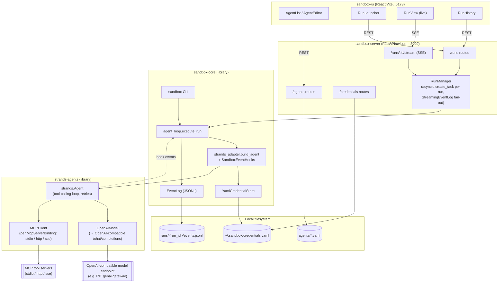

# agent-sandbox: system architecture

## Purpose

`agent-sandbox` is a bring-your-own-agent research sandbox: a researcher defines
an agent (system prompt, model endpoint, MCP tool servers) as a declarative
spec, launches it against a task, and watches/replays the full turn-by-turn
trace. Agents can also be chained into a **pipeline** — a deterministic,
harness-driven sequence of agent steps where one step's output feeds the
next step's task — without any pipeline-specific logic living in
sandbox-core itself. The longer-term product goal is an RIT-gated hosted
version of this, extensible enough to run real multi-step agent pipelines
(e.g. a predictive-maintenance classification pipeline) natively; today it's
a single-user local dev tool with no auth layer.

The project is split into four independently-versioned pieces that layer
cleanly on top of each other:

```
sandbox-ui  ──HTTP/SSE──▶  sandbox-server  ──imports──▶  sandbox-core
                                                              │
schema/  (JSON Schema exports of sandbox-core's pydantic models, for
          any non-Python consumer)
```

- **`sandbox-core`** — zero-web-framework Python library: the pydantic
  schemas for agents/runs/events, and the headless async runtime that
  actually talks to an LLM endpoint and MCP servers. Usable standalone via
  its `sandbox` CLI with no server running at all.
- **`sandbox-server`** — a thin FastAPI wrapper. Owns no execution logic of
  its own beyond bridging `sandbox-core`'s event stream to SSE; every route
  either reads/writes YAML files or calls straight into `sandbox-core`.
- **`sandbox-ui`** — a React/Vite single-page app for authoring agents,
  launching runs, and watching them live.
- **`schema/`** — versioned JSON Schema (`*.v1.json`) exports of the
  pydantic models, generated via `sandbox-core`'s `export_schemas.py`, so a
  non-Python client (or a future hosted UI) has a contract to code against
  without depending on the Python package.

## Component diagram



## Components

### sandbox-core (`sandbox-core/src/sandbox_core/`)

The heart of the system — importable and runnable with no server or UI at
all. The actual agent loop, model retries, and MCP session lifecycle are
[Strands Agents](https://strandsagents.com) (`strands-agents`), not hand-rolled
here; sandbox-core's own code is the YAML/pydantic authoring surface plus a
thin adapter that turns a validated `AgentSpec` into a `strands.Agent` and
translates its hook events into our own `Event` union.

**Schemas** (`schemas/`), all pydantic v2 models:

- `agent_spec.py` — `AgentSpec` (id, name, system prompt, `ModelConfig`,
  list of `McpServerBinding`, list of `SubAgentBinding`, `max_turns`).
  `McpServerBinding` carries transport (`stdio`/`http`/`sse`), a raw
  `connection` dict, an optional `credential_ref`, an `allowed_tools`
  allowlist, and a `logging_policy` (`full`/`hashed`/`metadata`).
- `run_spec.py` — `RunSpec` (generated `run_id`, `agent_id`, `task`,
  `created_at`, optional `max_turns` override).
- `events.py` — the `Event` union (discriminated on `type`):
  `LlmRequestEvent`, `LlmResponseEvent`, `ToolCallEvent`, `ToolResultEvent`,
  `AgentSpawnEvent`, `AgentResultEvent`, `ErrorEvent`. Also owns
  `redact_result()`, which applies an `McpServerBinding.logging_policy` to a
  tool result before it's persisted (full passthrough, sha256+shape hash, or
  tool/arg-keys-only metadata) — the raw unredacted value still goes back to
  the model, only what's written to disk is policy-filtered.
- `credentials.py` — the `CredentialResolver` protocol (`resolve(ref) -> str`)
  that decouples the runtime from any one secret-storage backend.

**Runtime** (`runtime/`):

- `strands_adapter.py` — the actual "harness": `build_agent()` resolves the
  model API key, builds an `OpenAIModel` pointed at `ModelConfig.base_url`
  (any OpenAI-compatible `/chat/completions` endpoint — RIT's gateway, local
  vLLM, any BYO target), builds one `strands.tools.mcp.MCPClient` per
  `McpServerBinding` (stdio/http/sse, with `tool_filters` enforcing
  `allowed_tools` and per-binding credential injection into headers/env), and
  constructs a `strands.Agent` wired to both plus a `SandboxEventHooks`
  instance. `SandboxEventHooks` is a Strands `HookProvider` that translates
  `BeforeModelCallEvent`/`AfterModelCallEvent`/`BeforeToolCallEvent`/
  `AfterToolCallEvent` into our own `LlmRequestEvent`/`LlmResponseEvent`/
  `ToolCallEvent`/`ToolResultEvent` and appends each to `EventLog` as it
  fires — applying `redact_result()` per the owning binding's
  `logging_policy` along the way, exactly as the old hand-rolled loop did.
- `agent_loop.py` — `execute_run()` is the thin orchestration used by the CLI
  and the server: builds the agent (offloaded to a worker thread, since
  `Agent(tools=[MCPClient, ...])` synchronously loads every MCP server's
  tools on construction and shouldn't block a shared asyncio event loop),
  calls `agent.invoke_async(task, limits=Limits(turns=max_turns))`, and maps
  its terminal `stop_reason` onto our `Event` union: `"limit_turns"` becomes
  an `ErrorEvent` with `context.phase == "max_turns"` (matching the old
  hand-rolled loop's truncation behavior exactly), a model failure surfaced
  via the hook becomes the `ErrorEvent` it already logged, and a normal
  completion becomes `AgentResultEvent`. The actual tool-calling loop, model
  retries, and MCP session lifecycle all live in Strands now — this function
  no longer implements any of them.
- `credential_store.py` — `YamlCredentialStore`, a flat `ref -> value` YAML
  file at `~/.sandbox/credentials.yaml` (overridable via
  `SANDBOX_CREDENTIALS_PATH`). Raises typed errors
  (`CredentialNotFoundError`, `CredentialFileError`) with actionable
  messages rather than a bare `KeyError`/`FileNotFoundError`.
- `event_log.py` — `EventLog` appends one JSON line per event to
  `<output_root>/<run_id>/events.jsonl`, assigning a monotonic `seq` per run
  (resuming from the max `seq` already on disk, so re-opening an existing
  log doesn't collide). `read_events()` is the typed reverse of that.

**CLI** (`cli.py`): `sandbox run <agent_spec.yaml> --task "..."` loads an
`AgentSpec` from YAML (expanding `${VAR}` placeholders against the process
environment — e.g. so a committed spec doesn't hardcode an endpoint or key
ref), builds a `RunSpec`, and calls `execute_run()` directly — no server
involved. This is the standalone/headless path.

### sandbox-server (`sandbox-server/src/sandbox_server/`)

A FastAPI app (`main.py: create_app()`) that adds no execution logic of its
own — it's routes over `sandbox-core` plus one piece of glue:

- **`specs.py`** — reads/writes `AgentSpec` YAML files under a specs
  directory, one file per agent (`<id>.yaml`), with the same `${VAR}`
  expansion as the CLI's loader. This is the only place agents live in the
  current milestone — no database. `list_agent_specs()` skips files that
  fail to parse/validate rather than failing the whole listing.
- **`routes/agents.py`** — CRUD (`GET/POST /agents`, `GET/PUT/DELETE
  /agents/{id}`) directly over `specs.py`. Validation is just "the request
  body is a valid `AgentSpec`" — FastAPI/pydantic reject the rest with 422
  before the handler runs.
- **`routes/credentials.py`** — write-only over `YamlCredentialStore`:
  `POST /credentials/{ref}` sets a value, `GET /credentials` returns ref
  *names* only. There is deliberately no `GET /credentials/{ref}` — a secret
  value must never appear in a response body.
- **`routes/runs.py`** — `POST /runs` looks up the `AgentSpec` and calls
  `RunManager.launch_run()`, `GET /runs` lists summaries, `GET /runs/{id}`
  returns full detail (including all events, for a page load that missed
  the live stream).
- **`routes/stream.py`** — `GET /runs/{id}/stream`, replay-then-tail SSE.
  See "Run lifecycle & streaming" below.
- **`run_manager.py`** — the one piece of real logic sandbox-server owns:
  - `RunManager.launch_run()` builds a `RunSpec`, wraps a fresh `EventLog`
    in `StreamingEventLog` (overrides `append()` to write to
    `events.jsonl` exactly as before, then synchronously fan the same event
    out to every SSE subscriber for that run), and launches
    `sandbox_core.execute_run()` as an `asyncio.create_task` on the
    server's own event loop — not a thread or subprocess, since
    `sandbox-core`'s runtime is all async I/O (`httpx` + the `mcp` SDK) with
    no CPU-bound work to isolate.
  - Because everything shares one event loop, the fan-out needs no
    cross-thread synchronization: `append()`/`subscribe()`/`unsubscribe()`
    are all plain synchronous functions, so nothing can interleave between
    "snapshot events seen so far" and "register this subscriber's queue" —
    a client connecting mid-run can never miss or double-see an event.
  - A run that fails before ever touching `event_log` (bad credential, an
    MCP server that refuses to connect) still needs to reach the UI as a
    terminal event, so `_execute()` catches that and synthesizes an
    `ErrorEvent` with `context.phase == "error"`.
  - `list_runs()`/`get_run_detail()` merge in-memory tracked runs with
    whatever's on disk under `output_root`, so runs launched by a previous
    server process (or by the CLI directly) still show up.

### sandbox-ui (`sandbox-ui/src/`)

React + Vite + `react-router-dom`, talking to the server over plain
`fetch` (`api/client.ts`) plus one native `EventSource` for streaming
(`hooks/useRunStream.ts`).

- **Pages**: `AgentList` / `AgentEditor` (agent CRUD), `RunLauncher` (pick
  an agent + task, `POST /runs`), `RunView` (live run via SSE at
  `/runs/:runId/live`), `RunHistory` (list + replay past runs, including
  ones not launched from this UI session). `PipelineList` (pipelines are
  authored as YAML for now — no visual editor yet), `PipelineLauncher` (pick
  a pipeline + seed task, `POST /pipeline-runs`), `PipelineRunView` (polls
  `GET /pipeline-runs/{id}` — no SSE at the pipeline level, see "Pipelines"
  below — and links each step to its own ordinary `RunView`).
- **`api/client.ts`** is the single module that knows the server's routes
  and response shapes; components never call `fetch` directly. Errors from
  non-2xx responses are normalized into a typed `ApiError`, including
  pydantic validation-error details from a 422.
- **`components/`** — `AgentForm`, `CredentialRefInput` (lets a form field
  reference a credential by name without ever displaying its value),
  `EventLogViewer` (renders the typed event stream), `StatusBadge`,
  `TagInput`.
- Dev server on `:5173`/`:4173`; `sandbox-server`'s CORS middleware
  allowlists exactly those origins (see `_DEV_ORIGINS` in `main.py`).

### schema/

Versioned (`*.v1.json`) JSON Schema exports of every `sandbox-core` pydantic
model — `agent_spec`, `run_spec`, `event` (and each event subtype),
`credential_ref`, `mcp_server_binding`, `model_config`, `sub_agent_binding`,
`token_usage`, `pipeline_spec`, `pipeline_step`, `pipeline_run_spec`,
`pipeline_run_record`, `pipeline_step_result`. Generated by
`sandbox-core/src/sandbox_core/export_schemas.py`. Exists so a consumer that
isn't Python (a future hosted UI, another language's agent implementation)
has a versioned contract instead of needing to import the pydantic models
directly.

## Pipelines

A `PipelineSpec` (`schemas/pipeline_spec.py`) is a sequence of `Step`s — a
discriminated union (`kind` field, mirroring `events.py`'s `Event` union) of
two step shapes:

- **`PipelineStep`** (`kind: "agent"`, the default so pre-existing YAML with
  no `kind` field still validates unchanged): `step_id`, `agent_id`,
  `task_template`. A completely ordinary agent run with its own `run_id` and
  `events.jsonl`, produced by calling `agent_loop.execute_run()` exactly as a
  standalone run would. `task_template` supports two placeholders —
  `{{task}}` (the pipeline run's seed task) and
  `{{steps.<step_id>.output}}` (a prior step's `AgentResultEvent.final_output`)
  — plain string substitution, not a templating engine.
- **`GateStep`** (`kind: "gate"`): `gate` (a `"module.path:function_name"`
  import reference) and `on_result` (a decision-string → next-step_id map,
  with the `"__end__"` sentinel meaning "the pipeline completes successfully
  here"). No agent run backs a gate — it's a deterministic, in-process
  Python callable, run with every completed step's output so far
  (`dict[str, str]`, keyed by `step_id`) and returning a decision string.
  This is `agentic_ml`'s "agents propose, harness decides" pattern made
  generic, and it's what lets a `PipelineSpec` express a reject/retry loop
  (e.g. `verification → modeling`) that a strictly linear step list can't.
  A gate is deliberately **not sandboxed** — see "Known gaps" below.

The sandbox walks `steps` starting from the first declared `step_id`: a
completed agent step advances to the next step in declaration order; a gate
step's decision (looked up in `on_result`) can jump anywhere, including
backward. `PipelineSpec.max_steps` (default 50) caps total step executions
per run — the pipeline-level analog of `AgentSpec.max_turns` — so a gate that
always routes backward can't loop forever.

- **`runtime/pipeline_runner.py`** (`sandbox-core`) — `execute_pipeline()` is
  the thin coordinator: resolves each agent step's `AgentSpec` via an
  injected `AgentSpecLoader` (mirrors `CredentialResolver`'s role for
  secrets — decouples execution from *how* specs are stored), calls
  `execute_run()` per agent step, and resolves/calls each gate step's
  function via `_resolve_gate()`/`_run_gate()` (supports sync and async gate
  functions). Halts — returning a `PipelineRunRecord` with
  `status="errored"` — at the first agent step that doesn't finish with
  `AgentResultEvent`, the first gate that fails to resolve/run or returns a
  decision missing from its `on_result`, or once `max_steps` is exceeded;
  every halt reason is a clear message naming the offending step, mirroring
  `strands_adapter._mcp_client_for()`'s `_require()` rather than surfacing a
  bare `KeyError`/`AttributeError`. Also owns
  `save_pipeline_run_record()`/`read_pipeline_run_record()`, a single JSON
  file (`pipeline.json`) per pipeline run — not a JSONL event log, since
  there's no per-event fan-out at this level (each agent step's own run
  already has one). Each finished step's outcome is one of two
  `StepResult` variants (`schemas/pipeline_run.py`, same discriminated-union
  technique as `Step`): `PipelineStepResult` (agent id, run id, status,
  output) or `GateStepResult` (decision, `routed_to` — `None` means the
  gate routed to `"__end__"`).
- **`pipeline_specs.py` / `routes/pipelines.py`** (`sandbox-server`) — CRUD
  over `PipelineSpec` YAML files under `./pipelines`, same file-per-id
  pattern as `specs.py`/`routes/agents.py`.
- **`pipeline_run_manager.py` / `routes/pipeline_runs.py`** (`sandbox-server`)
  — `PipelineRunManager` mirrors `RunManager`'s shape (in-memory tracked runs
  + disk fallback, launched as an `asyncio.create_task`) but delegates every
  step to the *existing* `RunManager`/`execute_run` machinery. Its manifest
  root (`./pipeline-runs` by default, `SANDBOX_PIPELINE_RUNS_DIR`) is
  deliberately **not** a subdirectory of the agent-runs `output_root`
  (`./runs`): `RunManager.list_runs()` treats every immediate child directory
  of `output_root` as a candidate agent run, so a pipeline manifest living
  anywhere under it — even nested — would show up as a phantom entry in the
  plain agent-runs list. Each step's own per-agent-run `EventLog` still lives
  under the normal `output_root`, same as any standalone run.
- **No SSE at the pipeline level.** A pipeline run's live status is served
  by a plain polling `GET /pipeline-runs/{id}` (updated after each step
  completes); watching one *step* live still goes through the existing
  per-run SSE endpoint unchanged. This was a deliberate scope cut, not a
  limitation of the design — the pipeline layer was built to need zero
  changes to the SSE/event-log contract.
- **CLI**: `sandbox pipeline run <pipeline_spec.yaml> --task "..." --agents-dir <dir>`
  — the headless counterpart, using a `DirectoryAgentSpecLoader` over a
  directory of `<agent_id>.yaml` files instead of `sandbox-server`'s
  `specs.py`-backed loader.

## Run lifecycle & streaming

1. **Launch** — `sandbox-ui`'s `RunLauncher` (or the `sandbox` CLI, or any
   direct API caller) submits an agent id + task. Through the server, this
   becomes `RunManager.launch_run()`; standalone, it's `execute_run()`
   called straight from `cli.py`.
2. **Execution** — `execute_run()` resolves the model API key via the
   `CredentialResolver`, builds a `strands.Agent` wired to every MCP server on
   the spec, and runs it (`agent.invoke_async(..., limits=Limits(turns=...))`)
   until a final answer, an error, or `max_turns` is hit.
3. **Persistence** — every event (`llm_request`, `llm_response`,
   `tool_call`, `tool_result`, terminal `agent_result`/`error`) is appended
   to `runs/<run_id>/events.jsonl` as it happens — this file is the single
   source of truth regardless of whether anyone is watching live.
4. **Streaming** — when running under the server, `StreamingEventLog`
   fans out the same event to any SSE subscribers as it's written. A
   client hitting `GET /runs/{id}/stream`:
   - **currently tracked & running** — gets a replay of events-so-far, then
     tails the live queue (polling every 1s to notice disconnects, since an
     ASGI server won't interrupt an in-progress generator on socket close).
   - **currently tracked & finished** — gets the replay only; nothing more
     will ever be broadcast.
   - **not tracked by this process** (server restarted, or the run was
     launched by the CLI) — one-shot replay straight from
     `events.jsonl` on disk, no live tail.
5. **Status derivation** — a run's status (`running` / `completed` /
   `errored` / `truncated`) is either tracked live in memory, or derived
   from the last terminal event in its `events.jsonl` (`truncated` iff
   the terminal `ErrorEvent`'s `context.phase == "max_turns"`).

## Data flow for a single agent turn

```mermaid
sequenceDiagram
    participant Run as agent_loop.execute_run()
    participant Agent as strands.Agent
    participant LLM as Model endpoint
    participant MCP as MCP server
    participant Hooks as SandboxEventHooks
    participant Log as EventLog

    Run->>Agent: invoke_async(task, limits=Limits(turns=max_turns))
    Agent->>LLM: POST /chat/completions
    LLM-->>Agent: choice (content or tool_calls)
    Agent->>Hooks: BeforeModelCallEvent / AfterModelCallEvent
    Hooks->>Log: append(LlmRequestEvent) / append(LlmResponseEvent)
    alt no tool_calls
        Agent-->>Run: AgentResult(stop_reason="end_turn", ...)
        Run->>Log: append(AgentResultEvent)
    else has tool_calls
        loop each tool call
            Agent->>MCP: call_tool(name, args)
            MCP-->>Agent: result
            Agent->>Hooks: BeforeToolCallEvent / AfterToolCallEvent
            Hooks->>Log: append(ToolCallEvent) / append(ToolResultEvent)
        end
        Note over Agent: result appended to conversation history; next turn begins
    end
    Note over Agent: hitting the turns cap ends the loop with stop_reason="limit_turns" —\nRun maps that to ErrorEvent(context.phase="max_turns")
```

## Security & isolation notes

- **Single-user, local-only by default**: `sandbox-server` binds
  `127.0.0.1`; there is no auth layer yet (the RIT-gated hosted version is
  future work, not built).
- **Secrets never round-trip through the API**: `POST /credentials/{ref}`
  is write-only, `GET /credentials` returns ref names only, and
  `AgentSpec`/`McpServerBinding` only ever carry a *reference* string
  (`credential_ref`, `api_key_ref`) — the resolver is the only thing that
  ever sees a real value, and it runs entirely in `sandbox-core`/
  `sandbox-server`, never in the browser.
- **Tool exposure is allowlisted per binding**: `McpServerBinding.allowed_tools`
  is enforced via `tool_filters` on each binding's `MCPClient` — a
  filtered-out tool is never loaded onto the agent in the first place (not
  offered as a schema).
- **Tool-result logging is policy-controlled**: `logging_policy` on each
  `McpServerBinding` (`full` / `hashed` / `metadata`) governs what actually
  lands in `events.jsonl`, independent of what the model itself receives —
  `SandboxEventHooks` applies `redact_result()` when persisting
  `ToolResultEvent`, after Strands has already fed the unredacted result back
  to the model, so a noisy or sensitive tool result can be redacted from the
  persisted trace without changing agent behavior.

## Known gaps / not yet built

- **Auth / RIT gating** — the product goal from the project vision; nothing
  in this codebase implements it yet.
- **Sub-agent spawning** — `AgentSpec.sub_agents` (`SubAgentBinding`) and
  `AgentSpawnEvent` are defined in the schema layer, but `strands_adapter.py`
  does not yet build child agents or expose them as tools via Strands'
  `agent.as_tool()` — the wiring is still schema-only. Strands makes this a
  much smaller lift than it used to be, and the piece that used to be
  missing — a way to resolve an agent id into another `AgentSpec` — now
  exists (`AgentSpecLoader`, built for pipelines; see "Pipelines" above) and
  could be reused here. Deliberately not pursued as the pipeline mechanism
  though: LLM-driven sequencing is the opposite of the harness-driven
  `PipelineSpec` design.
- **Gate execution is trusted, in-process Python only** — `GateStep` (see
  "Pipelines" above) resolves `gate` by ordinary Python import and calls it
  directly in the sandbox-server process, with no subprocess isolation or
  AST validation of any kind. This is fine for an operator-authored gate
  reusing e.g. `agentic_ml.harness.*` functions unmodified, but
  `agentic_ml`'s real `modeling` gate needs to sandbox-execute *untrusted
  LLM-generated* code (AST-checked, subprocess-isolated, per
  `agent-frontend/CLAUDE.md`'s forkserver requirements) — that isolation
  layer is a separate, not-yet-built piece of work.
- **Gate authoring in the browser is round-trip-safe but not visualized as a
  graph** — `PipelineForm` (`sandbox-ui`) can create/edit gate steps
  (function path + decision→step_id table) alongside agent steps, but the
  pipeline is still shown as a flat, top-to-bottom list; a gate that jumps
  backward isn't rendered as a loop.
- **No database** — agent specs, pipeline specs, and runs are all files
  under `agents/*.yaml` / `pipelines/*.yaml` / `runs/<run_id>/` /
  `pipeline-runs/<pipeline_run_id>/`. Fine for single-user local dev; would
  need to change for a multi-tenant hosted version.

## Local dev workflow

`./start.sh` (from `agent-sandbox/`) installs both Python packages
editable (`pip install -e ./sandbox-core -e ./sandbox-server`, or via `uv`
if `pip` isn't available) and the UI's npm dependencies if missing, then
runs both dev servers via `setsid` (so Ctrl+C kills each server's whole
process group, e.g. `npm run dev`'s spawned `vite` child too):

- `sandbox-server` at `http://127.0.0.1:8000` (log: `server.log`)
- `sandbox-ui` at `http://localhost:5173` (log: `ui.log`)

Agent specs default to `./agents`, pipeline specs to `./pipelines`, run
output to `./runs`, pipeline-run manifests to `./pipeline-runs` — all
relative to `start.sh`'s directory — override with `SANDBOX_AGENTS_DIR` /
`SANDBOX_PIPELINES_DIR` / `SANDBOX_RUNS_DIR` / `SANDBOX_PIPELINE_RUNS_DIR` /
`SANDBOX_CREDENTIALS_PATH` env vars before running it.

To run a single agent with no server at all:

```bash
sandbox run agents/file-writer.yaml --task "write a file that says hello"
```

To run a pipeline with no server at all:

```bash
sandbox pipeline run pipelines/sensor-report.yaml --task "..." --agents-dir ./agents
```
