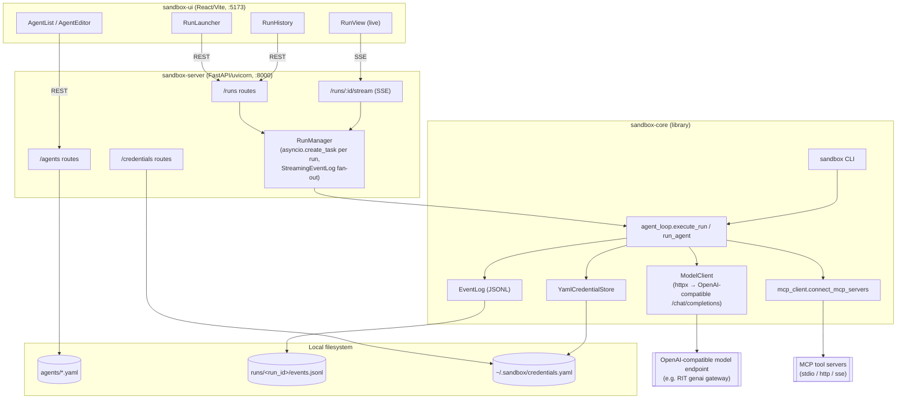

# agent-sandbox: system architecture

## Purpose

`agent-sandbox` is a bring-your-own-agent research sandbox: a researcher defines
an agent (system prompt, model endpoint, MCP tool servers) as a declarative
spec, launches it against a task, and watches/replays the full turn-by-turn
trace. The longer-term product goal is an RIT-gated hosted version of this;
today it's a single-user local dev tool with no auth layer.

The project is split into four independently-versioned pieces that layer
cleanly on top of each other:

```
sandbox-ui  ──HTTP/SSE──▶  sandbox-server  ──imports──▶  sandbox-core
                                                              │
schema/  (JSON Schema exports of sandbox-core's pydantic models, for
          any non-Python consumer)
```

- **`sandbox-core`** — zero-web-framework Python library: the pydantic
  schemas for agents/runs/events, and the headless async runtime that
  actually talks to an LLM endpoint and MCP servers. Usable standalone via
  its `sandbox` CLI with no server running at all.
- **`sandbox-server`** — a thin FastAPI wrapper. Owns no execution logic of
  its own beyond bridging `sandbox-core`'s event stream to SSE; every route
  either reads/writes YAML files or calls straight into `sandbox-core`.
- **`sandbox-ui`** — a React/Vite single-page app for authoring agents,
  launching runs, and watching them live.
- **`schema/`** — versioned JSON Schema (`*.v1.json`) exports of the
  pydantic models, generated via `sandbox-core`'s `export_schemas.py`, so a
  non-Python client (or a future hosted UI) has a contract to code against
  without depending on the Python package.

## Component diagram



## Components

### sandbox-core (`sandbox-core/src/sandbox_core/`)

The dependency-free heart of the system — importable and runnable with no
server or UI at all.

**Schemas** (`schemas/`), all pydantic v2 models:

- `agent_spec.py` — `AgentSpec` (id, name, system prompt, `ModelConfig`,
  list of `McpServerBinding`, list of `SubAgentBinding`, `max_turns`).
  `McpServerBinding` carries transport (`stdio`/`http`/`sse`), a raw
  `connection` dict, an optional `credential_ref`, an `allowed_tools`
  allowlist, and a `logging_policy` (`full`/`hashed`/`metadata`).
- `run_spec.py` — `RunSpec` (generated `run_id`, `agent_id`, `task`,
  `created_at`, optional `max_turns` override).
- `events.py` — the `Event` union (discriminated on `type`):
  `LlmRequestEvent`, `LlmResponseEvent`, `ToolCallEvent`, `ToolResultEvent`,
  `AgentSpawnEvent`, `AgentResultEvent`, `ErrorEvent`. Also owns
  `redact_result()`, which applies an `McpServerBinding.logging_policy` to a
  tool result before it's persisted (full passthrough, sha256+shape hash, or
  tool/arg-keys-only metadata) — the raw unredacted value still goes back to
  the model, only what's written to disk is policy-filtered.
- `credentials.py` — the `CredentialResolver` protocol (`resolve(ref) -> str`)
  that decouples the runtime from any one secret-storage backend.

**Runtime** (`runtime/`):

- `agent_loop.py` — the actual tool-calling loop. `run_agent()` takes an
  already-resolved `model_client` and already-connected `servers` dict (so
  it's trivially testable with fakes) and drives turns up to `max_turns`:
  call the model → log the request/response → if no tool calls, done
  (`AgentResultEvent`); otherwise execute each requested tool call against
  the owning `ConnectedMcpServer`, append `ToolCallEvent`/`ToolResultEvent`,
  feed the result back as a `tool` message, and loop. Hitting `max_turns`
  without a final answer produces an `ErrorEvent` with
  `context.phase == "max_turns"`. `execute_run()` is the full orchestration
  used by the CLI and the server: resolves the model API key, connects every
  MCP server, calls `run_agent()`, and guarantees all connections close on
  the way out.
- `model_client.py` — `ModelClient` posts directly to
  `{base_url}/chat/completions` with `httpx` (no `openai` SDK dependency,
  since every target — RIT's gateway, local vLLM, any BYO endpoint — only
  needs to be OpenAI-compatible). Retries on `429`/5xx/timeout/connect
  errors with exponential backoff (capped at 8s, `max_retries` attempts);
  any other failure becomes an `ErrorEvent` rather than raising.
- `mcp_client.py` — `connect_mcp_servers()` is an async context manager that
  opens a session per `McpServerBinding` (stdio/http/sse, via the `mcp` SDK),
  lists and allowlist-filters its tools, and yields
  `{binding.name: ConnectedMcpServer}`; every session is guaranteed closed on
  exit via an `AsyncExitStack`. `ConnectedMcpServer.call_tool()` is the
  enforcement point for `allowed_tools` (a filtered-out tool never reaches
  the server) and for `logging_policy` (via `redact_result`).
- `credential_store.py` — `YamlCredentialStore`, a flat `ref -> value` YAML
  file at `~/.sandbox/credentials.yaml` (overridable via
  `SANDBOX_CREDENTIALS_PATH`). Raises typed errors
  (`CredentialNotFoundError`, `CredentialFileError`) with actionable
  messages rather than a bare `KeyError`/`FileNotFoundError`.
- `event_log.py` — `EventLog` appends one JSON line per event to
  `<output_root>/<run_id>/events.jsonl`, assigning a monotonic `seq` per run
  (resuming from the max `seq` already on disk, so re-opening an existing
  log doesn't collide). `read_events()` is the typed reverse of that.

**CLI** (`cli.py`): `sandbox run <agent_spec.yaml> --task "..."` loads an
`AgentSpec` from YAML (expanding `${VAR}` placeholders against the process
environment — e.g. so a committed spec doesn't hardcode an endpoint or key
ref), builds a `RunSpec`, and calls `execute_run()` directly — no server
involved. This is the standalone/headless path.

### sandbox-server (`sandbox-server/src/sandbox_server/`)

A FastAPI app (`main.py: create_app()`) that adds no execution logic of its
own — it's routes over `sandbox-core` plus one piece of glue:

- **`specs.py`** — reads/writes `AgentSpec` YAML files under a specs
  directory, one file per agent (`<id>.yaml`), with the same `${VAR}`
  expansion as the CLI's loader. This is the only place agents live in the
  current milestone — no database. `list_agent_specs()` skips files that
  fail to parse/validate rather than failing the whole listing.
- **`routes/agents.py`** — CRUD (`GET/POST /agents`, `GET/PUT/DELETE
  /agents/{id}`) directly over `specs.py`. Validation is just "the request
  body is a valid `AgentSpec`" — FastAPI/pydantic reject the rest with 422
  before the handler runs.
- **`routes/credentials.py`** — write-only over `YamlCredentialStore`:
  `POST /credentials/{ref}` sets a value, `GET /credentials` returns ref
  *names* only. There is deliberately no `GET /credentials/{ref}` — a secret
  value must never appear in a response body.
- **`routes/runs.py`** — `POST /runs` looks up the `AgentSpec` and calls
  `RunManager.launch_run()`, `GET /runs` lists summaries, `GET /runs/{id}`
  returns full detail (including all events, for a page load that missed
  the live stream).
- **`routes/stream.py`** — `GET /runs/{id}/stream`, replay-then-tail SSE.
  See "Run lifecycle & streaming" below.
- **`run_manager.py`** — the one piece of real logic sandbox-server owns:
  - `RunManager.launch_run()` builds a `RunSpec`, wraps a fresh `EventLog`
    in `StreamingEventLog` (overrides `append()` to write to
    `events.jsonl` exactly as before, then synchronously fan the same event
    out to every SSE subscriber for that run), and launches
    `sandbox_core.execute_run()` as an `asyncio.create_task` on the
    server's own event loop — not a thread or subprocess, since
    `sandbox-core`'s runtime is all async I/O (`httpx` + the `mcp` SDK) with
    no CPU-bound work to isolate.
  - Because everything shares one event loop, the fan-out needs no
    cross-thread synchronization: `append()`/`subscribe()`/`unsubscribe()`
    are all plain synchronous functions, so nothing can interleave between
    "snapshot events seen so far" and "register this subscriber's queue" —
    a client connecting mid-run can never miss or double-see an event.
  - A run that fails before ever touching `event_log` (bad credential, an
    MCP server that refuses to connect) still needs to reach the UI as a
    terminal event, so `_execute()` catches that and synthesizes an
    `ErrorEvent` with `context.phase == "error"`.
  - `list_runs()`/`get_run_detail()` merge in-memory tracked runs with
    whatever's on disk under `output_root`, so runs launched by a previous
    server process (or by the CLI directly) still show up.

### sandbox-ui (`sandbox-ui/src/`)

React + Vite + `react-router-dom`, talking to the server over plain
`fetch` (`api/client.ts`) plus one native `EventSource` for streaming
(`hooks/useRunStream.ts`).

- **Pages**: `AgentList` / `AgentEditor` (agent CRUD), `RunLauncher` (pick
  an agent + task, `POST /runs`), `RunView` (live run via SSE at
  `/runs/:runId/live`), `RunHistory` (list + replay past runs, including
  ones not launched from this UI session).
- **`api/client.ts`** is the single module that knows the server's routes
  and response shapes; components never call `fetch` directly. Errors from
  non-2xx responses are normalized into a typed `ApiError`, including
  pydantic validation-error details from a 422.
- **`components/`** — `AgentForm`, `CredentialRefInput` (lets a form field
  reference a credential by name without ever displaying its value),
  `EventLogViewer` (renders the typed event stream), `StatusBadge`,
  `TagInput`.
- Dev server on `:5173`/`:4173`; `sandbox-server`'s CORS middleware
  allowlists exactly those origins (see `_DEV_ORIGINS` in `main.py`).

### schema/

Versioned (`*.v1.json`) JSON Schema exports of every `sandbox-core` pydantic
model — `agent_spec`, `run_spec`, `event` (and each event subtype),
`credential_ref`, `mcp_server_binding`, `model_config`, `sub_agent_binding`,
`token_usage`. Generated by `sandbox-core/src/sandbox_core/export_schemas.py`.
Exists so a consumer that isn't Python (a future hosted UI, another
language's agent implementation) has a versioned contract instead of needing
to import the pydantic models directly.

## Run lifecycle & streaming

1. **Launch** — `sandbox-ui`'s `RunLauncher` (or the `sandbox` CLI, or any
   direct API caller) submits an agent id + task. Through the server, this
   becomes `RunManager.launch_run()`; standalone, it's `execute_run()`
   called straight from `cli.py`.
2. **Execution** — `execute_run()` resolves the model API key via the
   `CredentialResolver`, opens every MCP server connection on the spec, and
   runs `run_agent()`'s turn loop until a final answer, an error, or
   `max_turns` is hit.
3. **Persistence** — every event (`llm_request`, `llm_response`,
   `tool_call`, `tool_result`, terminal `agent_result`/`error`) is appended
   to `runs/<run_id>/events.jsonl` as it happens — this file is the single
   source of truth regardless of whether anyone is watching live.
4. **Streaming** — when running under the server, `StreamingEventLog`
   fans out the same event to any SSE subscribers as it's written. A
   client hitting `GET /runs/{id}/stream`:
   - **currently tracked & running** — gets a replay of events-so-far, then
     tails the live queue (polling every 1s to notice disconnects, since an
     ASGI server won't interrupt an in-progress generator on socket close).
   - **currently tracked & finished** — gets the replay only; nothing more
     will ever be broadcast.
   - **not tracked by this process** (server restarted, or the run was
     launched by the CLI) — one-shot replay straight from
     `events.jsonl` on disk, no live tail.
5. **Status derivation** — a run's status (`running` / `completed` /
   `errored` / `truncated`) is either tracked live in memory, or derived
   from the last terminal event in its `events.jsonl` (`truncated` iff
   the terminal `ErrorEvent`'s `context.phase == "max_turns"`).

## Data flow for a single agent turn

```mermaid
sequenceDiagram
    participant Loop as run_agent()
    participant Model as ModelClient
    participant LLM as Model endpoint
    participant MCP as ConnectedMcpServer
    participant Log as EventLog

    Loop->>Model: complete(messages, tools)
    Model->>LLM: POST /chat/completions
    LLM-->>Model: choice (content or tool_calls)
    Model-->>Loop: ModelTurn(request, response)
    Loop->>Log: append(LlmRequestEvent)
    Loop->>Log: append(LlmResponseEvent)
    alt no tool_calls
        Loop->>Log: append(AgentResultEvent)
    else has tool_calls
        loop each tool call
            Loop->>MCP: call_tool(name, args)
            MCP-->>Loop: (ToolCallEvent, ToolResultEvent, raw_value)
            Loop->>Log: append(ToolCallEvent)
            Loop->>Log: append(ToolResultEvent)
        end
        Note over Loop: raw_value appended to messages as a tool response; next turn begins
    end
```

## Security & isolation notes

- **Single-user, local-only by default**: `sandbox-server` binds
  `127.0.0.1`; there is no auth layer yet (the RIT-gated hosted version is
  future work, not built).
- **Secrets never round-trip through the API**: `POST /credentials/{ref}`
  is write-only, `GET /credentials` returns ref names only, and
  `AgentSpec`/`McpServerBinding` only ever carry a *reference* string
  (`credential_ref`, `api_key_ref`) — the resolver is the only thing that
  ever sees a real value, and it runs entirely in `sandbox-core`/
  `sandbox-server`, never in the browser.
- **Tool exposure is allowlisted per binding**: `McpServerBinding.allowed_tools`
  is enforced in `ConnectedMcpServer` — a filtered-out tool is invisible to
  the model (not offered as a schema) and rejected again defensively if the
  model names it anyway.
- **Tool-result logging is policy-controlled**: `logging_policy` on each
  `McpServerBinding` (`full` / `hashed` / `metadata`) governs what actually
  lands in `events.jsonl`, independent of what the model itself receives —
  so a noisy or sensitive tool result can be redacted from the persisted
  trace without changing agent behavior.

## Known gaps / not yet built

- **Auth / RIT gating** — the product goal from the project vision; nothing
  in this codebase implements it yet.
- **Sub-agent spawning** — `AgentSpec.sub_agents` (`SubAgentBinding`) and
  `AgentSpawnEvent` are defined in the schema layer, but `agent_loop.py`'s
  turn loop does not yet expose sub-agents as callable tools or spawn them —
  the wiring is schema-only today.
- **No database** — agent specs are files under `agents/*.yaml`, runs are
  directories under `runs/<run_id>/`. Fine for single-user local dev; would
  need to change for a multi-tenant hosted version.

## Local dev workflow

`./start.sh` (from `agent-sandbox/`) installs both Python packages
editable (`pip install -e ./sandbox-core -e ./sandbox-server`, or via `uv`
if `pip` isn't available) and the UI's npm dependencies if missing, then
runs both dev servers via `setsid` (so Ctrl+C kills each server's whole
process group, e.g. `npm run dev`'s spawned `vite` child too):

- `sandbox-server` at `http://127.0.0.1:8000` (log: `server.log`)
- `sandbox-ui` at `http://localhost:5173` (log: `ui.log`)

Agent specs default to `./agents`, run output to `./runs`, both relative to
`start.sh`'s directory — override with `SANDBOX_AGENTS_DIR` /
`SANDBOX_RUNS_DIR` / `SANDBOX_CREDENTIALS_PATH` env vars before running it.

To run a single agent with no server at all:

```bash
sandbox run agents/file-writer.yaml --task "write a file that says hello"
```
