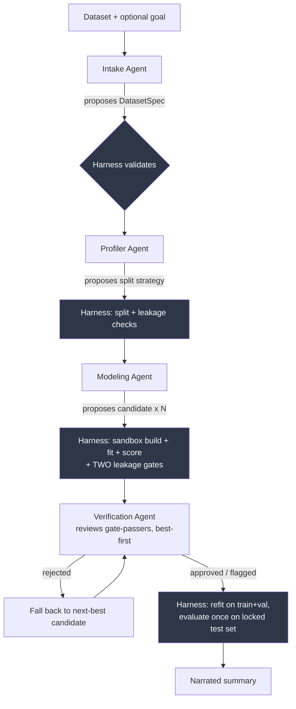

# Agentic ML Classification Pipeline — Project Overview

*A design-and-rationale walkthrough, written for someone evaluating the
project rather than someone about to modify the code. For the
file-by-file inventory of what's implemented, see [README.md](README.md).*

## 1. What we're building

A system where LLM agents handle the parts of a machine learning
workflow that require judgment — reading a dataset, deciding what to
predict, choosing a modeling approach — while a completely
deterministic, non-LLM "harness" handles every part that requires
correctness: splitting data, fitting models, computing metrics, and
detecting data leakage.

The input is a CSV or Parquet file and, optionally, a one-sentence
natural-language goal ("predict whether a customer will churn"). The
output is a trained binary classifier, an honest held-out test-set
score, and a plain-language summary — produced with no human in the
loop deciding column names, hyperparameters, or which model to trust.

The scope is deliberately narrow: single-machine, CPU, tabular data,
binary classification only. The point of the project isn't "build the
biggest AutoML system" — it's "build the smallest system where an LLM
agent can safely make modeling decisions without being able to fool
itself (or us) about whether those decisions were any good."

## 2. The central design principle: agents propose, the harness decides

This is the one idea everything else in the codebase follows from.

An LLM is good at judgment over structured facts: "this column's name
suggests it's a customer ID," "this dataset is imbalanced, prefer a
class-weighted model." An LLM is bad at things that need to be *exactly
right*: computing a statistic, holding out a test set correctly,
noticing its own preprocessing code leaked information from the test
fold into training. Those failure modes aren't rare edge cases in ML —
they're the standard ways a modeling result turns out to be wrong.

So the system draws a hard line:

| Agents are allowed to | Agents are never allowed to |
|---|---|
| Propose a target column | Choose the train/val/test split |
| Propose which columns are features | See the test set before final evaluation |
| Pick a modeling template + hyperparameters | Compute their own metrics |
| Summarize results in plain language | Decide which candidate gets promoted |
| Flag or reject a candidate on a second look | Approve/unblock a candidate that failed a gate |

That last row is the verification agent (§5.4), and it's worth
stating precisely: it has strictly one-directional power. It can make
an already-gated candidate's fate *worse* (flagged or rejected), never
*better*. It is structurally incapable of overriding a deterministic
failure, because it is never shown a candidate that produced one.

Every agent output is a **proposal** — a JSON object — that the harness
independently re-validates before acting on it. An agent hallucinating
a column name, picking a leaky preprocessing step, or claiming a metric
it never computed doesn't corrupt the result; it just gets rejected.
This is what makes the phrase "LLM agent" survivable in a context where
the output has to be trustworthy.

## 3. System architecture

Every box shaded dark is pure deterministic code — no LLM call. Every
white box is an LLM agent, and every arrow leaving a white box passes
through a validation step before it can affect anything. The
Verification Agent's only two exits are "let it through" (approved or
flagged) and "reject, try the next one" — there is no path from that
box back to overriding G.

## 4. The deterministic harness (the trust boundary)

The harness is not a supporting library — it's the part of the system
that actually decides whether a result is real. It owns:

- **Dataset loading + content hashing.** Every run records a SHA-256
  hash of the exact data used, so a result is always traceable to
  specific bytes, not just a filename that might have changed.
- **Splitting.** Five strategies — random, stratified, group, time,
  and group+time — chosen because the most common way a classroom or
  real-world ML result turns out to be fake is a random split on data
  that isn't independent and identically distributed (repeated
  customers, or a timestamp). The harness requires an explicit
  strategy; there's no silent default to random split when a time or
  group column is declared.
- **Leakage checks**, run automatically and independently of each
  other: exact-duplicate rows across splits, group overlap across
  splits, chronological ordering for time splits, a raw
  feature-vs-target correlation check, and a **label-permutation
  test** — fit the *actual candidate pipeline* on shuffled labels and
  confirm it scores at chance. That last one is the most important:
  it catches the classic bug where a preprocessing step (a scaler, an
  encoder) was accidentally fit on data outside its proper training
  fold, which a simple leakage check on the raw split can't see at
  all because the corruption happens inside the modeling code, not in
  the split itself.
- **Sandboxed execution.** Agent-selected model code never runs in the
  main process. It's statically checked (AST-level — reject forbidden
  imports and calls like `eval`, `open`, `subprocess`) and then
  executed in an isolated subprocess with no network access, a
  wall-clock timeout, and CPU limits. Only the resulting *unfitted*
  model object is allowed to cross back — never raw data, never a file
  path.
- **Metrics with confidence intervals**, via bootstrap resampling —
  because a single point-estimate ROC-AUC on 130 held-out rows without
  a confidence interval is not a claim, it's a guess with a stated
  precision hidden.
- **An append-only leaderboard** so every candidate ever evaluated is
  recorded, not just the winner.

## 5. The four agents

Each agent gets exactly one or two tools, a narrow JSON output
contract, and — critically — no ability to see or influence anything
outside that contract. None of them can read a raw file path; they
only ever see data the harness has already loaded and computed facts
about.

### 5.1 Intake Agent

**Problem it solves:** turning "here's a CSV, and maybe a sentence
about what I want" into a formal problem specification — which column
is the label, which columns are identifiers or timestamps that must be
excluded from modeling.

**What it sees:** column names, dtypes, missingness, cardinality, and
name-based hints ("this column is named `customer_id`") — computed
*before* any target column is known, since proposing the target is
literally intake's job. It never sees anything that would require
already knowing the target (class balance, correlation with the
label) — that would be circular.

**What it proposes:** `{target_column, task, id_columns, group_column,
time_column, positive_label, reasoning}`.

**Why this design:** without intake, every dataset needs a human to
manually specify the target column before the pipeline can start. With
it, the system can run from just a dataset and a sentence — or from
just a dataset, guessing the most plausible target from the schema
alone. The harness re-validates the proposal regardless: the target
must have exactly two non-null values (this MVP is binary
classification only, and the harness enforces that itself — it does
not trust the agent's self-reported `task` field), and any group/time/id
column must actually exist in the data.

### 5.2 Profiler Agent

**Problem it solves:** producing a human-readable characterization of
the dataset and a data-driven recommendation for how to split it.

**What it sees:** one tool call's worth of deterministic facts — column
types, missingness, cardinality, likely id/group/datetime columns,
class imbalance ratio, and a rule-based `recommended_split_strategy`
(e.g., "this dataset has a customer ID column *and* a timestamp column,
so use group+time splitting to prevent both entity leakage and
temporal leakage simultaneously").

**What it proposes:** a plain-language summary and a list of key risks
— but it is explicitly instructed not to contradict or override the
tool's `recommended_split_strategy` or leakage flags. Its job is to
*explain* the facts, not generate new ones.

**Why this design:** this is the clearest illustration of the "agents
propose, harness decides" principle in the codebase. The split
strategy — arguably the single decision most likely to silently
invalidate every downstream result — is computed by a fully tested,
rule-based function with zero LLM involvement. The agent's only role is
narration for a human reader.

### 5.3 Modeling Agent

**Problem it solves:** choosing a modeling approach appropriate to the
dataset's characteristics and producing a working, evaluable pipeline.

**What it sees:** the profiler's facts, plus a catalog of six
pre-built, pre-validated "recipe templates" with descriptions of when
each is appropriate.

**What it proposes:** `{candidate_id, template_id, config,
explanation}` — it picks a template by name and fills in a config
dictionary (which columns are numeric/categorical, a few
hyperparameters). **It does not write model code.** See §6 for why.

**What the harness does with the proposal, none of which the agent
controls:** re-validates every column name against the profiler's
facts (rejecting anything hallucinated, or anything flagged as an ID,
group, or time column); statically checks and sandbox-builds the
chosen template with the agent's config; fits it on the training
fold; scores it on the validation fold with bootstrapped confidence
intervals; and requires **two independent leakage checks to both
pass** — the label-permutation test, and a feature-correlation check
re-run scoped to exactly the columns *this* candidate selected (§7
explains why one check alone isn't enough). Only then does the
candidate become eligible for review by the next agent.

### 5.4 Verification Agent

**Problem it solves:** a second, independent opinion on a candidate
that has already cleared every deterministic gate — the kind of review
a human collaborator would give a teammate's already-passing pull
request before merging it.

**What it sees:** a bundle assembled purely from facts other parts of
the system already computed: the template's own description of when
it's appropriate, the candidate's config and stated explanation,
validation metrics with confidence intervals, both leakage check
results, and the profiler's imbalance/leakage-risk facts. It computes
nothing itself.

**What it proposes:** `{verdict, concerns, reasoning}`, where `verdict`
is `"approved"`, `"flagged"` (proceed, but the concern is recorded for
a human), or `"rejected"` (blocked). It's told to look for things a
deterministic check can't easily express: does the candidate's stated
*reason* for its choices actually match what the config *does*? Does a
suspiciously perfect score deserve a second look even though it
technically passed both leakage gates?

**Why this design — the asymmetric trust boundary:** this agent is
structurally unable to approve or unblock a candidate that failed a
deterministic gate, because the harness only ever shows it candidates
that already passed both. Its JSON schema has no "override" option. A
malformed or unparseable response from the LLM doesn't default to
`"approved"` either — it degrades to `"flagged"`, the same conservative
middle ground used everywhere else in this system when something
doesn't parse cleanly. This is a one-way ratchet: every layer this
agent sits behind can only make a candidate's fate worse, never better.

**How the orchestrator uses it:** candidates that passed the harness's
gates are reviewed **best-first, by validation score**. A `"rejected"`
verdict doesn't fail the whole run — it falls back to the next-best
gate-passing candidate and reviews that one instead, continuing until
one is accepted or the pool is exhausted. Every candidate that gets
reviewed (not just the winner) is logged with its verdict, so the
leaderboard is also an audit trail of what got vetoed and why.

## 6. Recipe templates: the middle ground

The most consequential design decision in the whole project is **what
the modeling agent is and isn't allowed to generate.**

The tempting version — let the LLM write arbitrary Python/sklearn code
— was rejected. Free-form generated code is very hard to statically
verify for safety or correctness, and a subtly wrong preprocessing
step (the single most common way ML pipelines leak information) is
exactly the kind of bug that's easy for an LLM to introduce and hard
for a static checker to catch.

The other extreme — one fixed pipeline, no agent choice at all — was
also rejected, because then there's no meaningful modeling decision
left for an agent to make.

The middle ground: a small library of **verified templates**, each a
static Python file exposing a `build_pipeline(config)` function. The
agent's decision surface is choosing *which* template and *which*
config values — a much smaller, much more auditable space than
arbitrary code. Currently there are six, each chosen to cover a
distinct, real failure mode in tabular ML:

| Template | Handles |
|---|---|
| `logistic_numeric` | Numeric-only baseline, cheapest linear-separability check |
| `sklearn_mixed_pipeline` | General mixed numeric/categorical data |
| `lightgbm_mixed` | Moderate/high-cardinality categoricals without one-hot blowup |
| `xgboost_mixed` | Missing values as potentially informative (no imputation) |
| `imbalanced_binary_boosted` | Class-weighted reweighting instead of resampling, avoiding the classic "fit the resampler before the split" leakage bug |
| `high_cardinality_target_encoding` | sklearn's cross-fitted `TargetEncoder` — leakage-safe by construction |

Each template's docstring explains *why* it's built the way it is, not
just what it does — several encode a specific leakage lesson (e.g. why
target encoding must be internally cross-fitted, why resampling for
class imbalance is riskier than reweighting).

## 7. Safety layers, concretely

It's worth being specific about what actually stops a bad agent
proposal from becoming a bad result, because "the harness validates
things" is vague until you see the layers:

1. **Shape validation** — is the proposal even well-formed JSON with
   the required keys?
2. **Column validation** — does every referenced column exist, and is
   it not the target/id/group/time column?
3. **Config validation** — does the config satisfy the chosen
   template's required keys?
4. **Static AST check** — before executing anything, reject forbidden
   imports (`os`, `subprocess`, `socket`, ...) and forbidden calls
   (`eval`, `exec`, `open`, ...).
5. **Sandboxed execution** — the (now statically-cleared) template code
   runs in an isolated subprocess with no network, a timeout, and CPU
   limits, and only an *unfitted* model object crosses back.
6. **Label-permutation leakage gate** — fit the actual pipeline on
   shuffled labels; if it scores meaningfully above chance, something
   in the pipeline is leaking.
7. **Feature-correlation leakage gate, candidate-scoped** — re-run a
   raw correlation-with-target check on exactly the columns *this*
   candidate selected. Layers 6 and 7 catch genuinely different bugs:
   permutation testing catches leakage in the modeling *process* (a
   preprocessing step that saw data it shouldn't have), while the
   correlation check catches leakage in raw *feature content* (a
   column that's just a copy of the target under a different name). A
   candidate can fail one and pass the other — a test in this project
   proves exactly that: a candidate that selects a near-perfect proxy
   column for the target passes the permutation test (shuffled labels
   make the proxy just as useless as everything else) but is correctly
   caught by the correlation check. Neither gate is redundant; that's
   why both must run on every candidate.
8. **Verification agent audit** (§5.4) — only reached by candidates
   that already passed every gate above. It can flag or reject; it
   cannot approve or unblock anything that failed layers 1–7.

Only a candidate that clears all eight layers reaches the leaderboard
as a promotion-eligible result — everything earlier in the list is a
hard stop, not a suggestion.

Layer 5 surfaced a genuinely interesting bug during development: a
template that defined its own custom transformer class failed at the
sandbox boundary, because the *unfitted pipeline* has to be pickled
across the process boundary, and Python's pickling-by-reference can't
reliably resolve a class defined inside dynamically executed code. The
fix (documented in `harness/sandbox.py`) was a hard rule for every
template: compose pipelines only from objects that live in real,
importable libraries. It's a good example of the sandbox's own
architecture surfacing a correctness constraint we hadn't anticipated,
rather than silently producing a wrong pipeline.

## 8. The orchestrator: closing the loop

Everything above runs as a single script (`run_orchestrator.py`) or,
for interactive inspection, a Jupyter notebook
(`notebooks/end_to_end_pipeline.ipynb`) that calls the exact same
underlying functions cell-by-cell so each phase's output — tables,
the profiler's narrative, a validation-metrics comparison across
candidates, an ROC curve — is visible rather than buried in print
statements.

The orchestrator's job, once the split is fixed:

1. Ask the modeling agent for up to *N* candidates (nudging it toward
   a different template each time), each independently run through
   both deterministic leakage gates.
2. Rank the gate-passing candidates by validation score and send them
   to the verification agent **one at a time, best-first**. The first
   one that isn't rejected is accepted; a rejection moves on to the
   next-best candidate instead of aborting the run. If every
   gate-passing candidate is rejected, the run stops and the test set
   is never touched.
3. Refit the accepted candidate on train+validation combined.
4. Evaluate it exactly once on the test set that has been locked since
   the very first split — this is the only test-set touch in the
   entire run.
5. Ask an LLM to narrate the outcome in plain language — a pure text
   summarization task with no tools and no ability to alter the
   result. If the accepted candidate was `"flagged"` rather than
   cleanly `"approved"`, the summary is asked to mention that as a
   caveat for human review.

Step 2 is deliberately not "verify every candidate, then pick the
best" — it's "pick the best, then verify," falling back only if
needed. That's both cheaper (fewer LLM calls than reviewing candidates
nobody was going to select anyway) and a better match for what a
review step is actually for: deciding whether to promote the thing
you're about to promote.

## 9. An engineering decision worth mentioning: why there's no OpenClaw

The original plan used OpenClaw (an existing agent-runtime framework)
to host these agents. During bootstrap testing we hit a confirmed,
reproducible bug in OpenClaw's own transcript-compaction logic that
made even a single-turn session fail — reproduced identically across
two releases, independent of model or prompt.

Rather than block the project on an upstream fix, we replaced OpenClaw
with about 260 lines of code total: a stateless OpenAI-compatible
client (`model_client.py`) and a minimal tool-calling loop with no
sessions or compaction (`agent_runtime.py`). None of the pipeline's
actual requirements — call a model, get a structured response,
optionally call a tool — needed OpenClaw's heavier machinery
(multi-channel messaging, cron scheduling, a skills marketplace). This
turned out to be a net simplification, not a workaround: the whole
agent runtime is easy to test with a fake model client (which is
exactly how every integration test in this project works — see §10).

## 10. Testing philosophy

Two distinct kinds of test exist, deliberately:

- **Unit tests for the harness** (splitting, leakage detection, the
  sandbox, metrics) — pure deterministic code, no LLM involved, fast
  and exhaustive.
- **Integration tests for the full agent loop** — these run the
  *actual* orchestrator code end-to-end, including the tool-calling
  loop, but with the model client's `.call()` method replaced by a
  stub that returns pre-scripted responses keyed off which system
  prompt and how many turns have elapsed. This proves the wiring
  between agents, tools, and the harness is correct without needing
  network access, an API key, or non-deterministic LLM output in CI.

55 tests currently pass. One is worth calling out specifically because
it proves a design claim rather than just exercising code: a test
constructs a dataset with a column that's a near-perfect copy of the
target, scripts a modeling-agent proposal that selects it, and asserts
that the *permutation* gate alone would not have caught it (shuffled
labels make the copied column just as uninformative as anything else)
while the *correlation* gate does. That's the empirical version of the
claim in §7 that the two leakage gates are complementary — the test
would fail if that claim were wrong.

The notebook itself was verified the same way — its actual cells (not
a hand-copied summary of them) were extracted and executed against a
stubbed client before being considered done each time it changed,
which has caught real bugs (e.g. a relative-path error in the final
reporting cell) that a visual read-through did not.

## 11. Current status

| Phase | Status |
|---|---|
| 0 — Model connectivity | Done |
| 1 — Deterministic harness | Done |
| 2 — Profiler agent | Done |
| 3 — Recipe templates + modeling agent | Done |
| 4 — Verification/audit agent | Done |
| 5 — Orchestrator (full loop) | Done |
| 6 — Priors/evidence reuse across runs | Not built |
| 7 — Parallel candidate search | Not built |

Built out of numeric order on purpose: Phase 5 came before Phase 4.
The deterministic gates in §7 already blocked leaky or broken
candidates without needing an LLM to audit them, so closing the loop
end-to-end first surfaced more real integration problems sooner than a
dedicated verification agent would have — including the fact that only
one of the two leakage gates §7 describes was actually wired into the
modeling step until Phase 4's work added the second one.

## 12. Key takeaways

- The interesting engineering problem here isn't "get an LLM to write
  ML code" — it's **building a trust boundary an LLM can't talk its
  way around.**
- Every agent has the smallest possible decision surface for its job,
  and every proposal is independently re-validated by code that has
  nothing to do with the LLM that produced it.
- Even the agent whose entire job is *skepticism* — the verification
  agent — is itself bound by the same trust boundary: it can only make
  an outcome more conservative, never less, and a malformed response
  from it defaults to caution rather than silent approval.
- The system is honest about its own limits: binary classification
  only, no test-set peeking, and leakage gates that will reject a
  candidate rather than let a suspicious result through — even at the
  cost of throwing away a legitimate one occasionally (a known,
  documented tradeoff of the label-permutation gate's parameters).
- Reproducibility isn't an afterthought: dataset hashing, seeded
  splits, and stubbed-client integration tests mean the entire loop —
  agentic parts included — is testable without a live model, and at
  least one test in this project exists specifically to prove a design
  claim empirically rather than just exercise code (§10).
